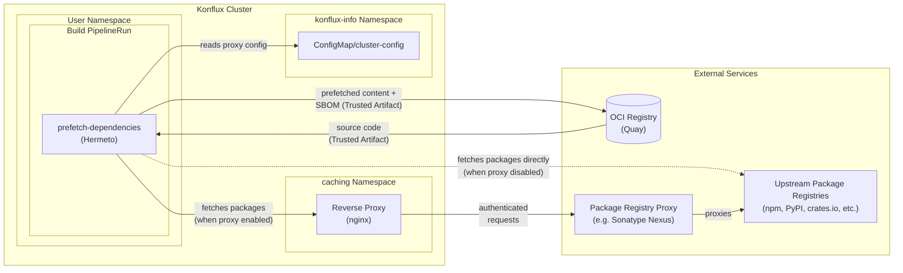
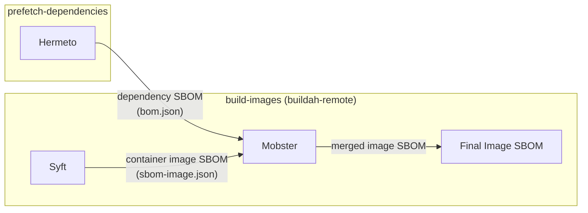

# Hermeto in Konflux Build Pipelines

[Hermeto](https://github.com/hermetoproject/hermeto) produces accurate dependency SBOMs for container builds. It
prefetches all declared dependencies before the build and relies on the
build running without network access (hermetic), so the SBOM is a
complete and trustworthy record of everything consumed.

## Why

Traditional approaches to generating SBOMs have known weaknesses:

- **Analyzed SBOMs** reverse-engineer image contents after the build,
  which can miss dependencies and produce false positives
- **Build-type SBOMs** depend on build tools accurately reporting
  everything they consume
- **Source SBOMs without hermetic builds** are produced from lockfiles,
  but the build can still pull in undeclared dependencies, making the
  SBOM incomplete

Hermeto combines a source SBOM with a hermetic build: the SBOM is
produced from lockfiles *before* the build, and network isolation
guarantees that nothing outside the SBOM was consumed. Hermeto never
executes third-party code (no setup scripts, no post-install hooks), so
the SBOM cannot be compromised by the prefetch process itself.

## How Hermeto fetches dependencies

Hermeto reads your project's lockfiles (e.g., `package-lock.json`,
`go.sum`, `requirements.txt`), downloads every declared dependency, and
injects the configuration needed for package managers to use the local
copies. The build pipeline's `hermetic` parameter controls whether the
buildah task runs without network access. When `hermetic` is set to
`true`, the build can only use what Hermeto prefetched. This parameter
defaults to `false`, but a Conforma policy enforces `hermetic=true` for
releasing product images.

The following diagram shows what Hermeto interacts with during
dependency prefetch, based on the
[docker-build-multi-platform-oci-ta](https://github.com/konflux-ci/build-definitions/tree/main/pipelines/docker-build-multi-platform-oci-ta)
pipeline definition.

- **Solid arrows** (→): primary data flow
- **Dashed arrows** (⇢): alternative path when the package registry
  proxy is not configured
- **Trusted Artifacts** are OCI artifacts used for inter-task data
  transfer in the build pipeline. The source code is produced by
  `clone-repository` and stored as a Trusted Artifact before Hermeto
  retrieves it
- See [ADR 0064](https://github.com/konflux-ci/architecture/blob/6ea709d01c4f5af323a0698203627dce7b2ae81b/ADR/0064-hermeto-package-registry-proxy.md) for
  package registry proxy configuration details

### Prefetched content

The output produced by Hermeto contains:

- **Prefetched dependencies** (`deps/`): downloaded packages organized
  by package manager (npm, pip, gomod, cargo, etc.)
- **Project configuration files**: injected into the source tree to
  point package managers at the local dependencies (e.g.,
  `.cargo/config.toml`, `.bundle/config`, RPM repo files)
- **Environment files**: shell variables sourced during the container
  build to configure package manager behavior
- **Dependency SBOM** (`bom.json`): see SBOM flow below

### Pipeline consumers

The prefetched content is stored as an OCI Trusted Artifact and consumed
by **build-images** (buildah tasks), **source-build**, and **SAST scan**
tasks. Application source code passes through `prefetch-dependencies`
unchanged.

## SBOM flow

The dependency SBOM produced by Hermeto flows through the build pipeline,
where it is merged with other SBOM sources into the final image SBOM.

- **Hermeto** generates a dependency SBOM in either CycloneDX
  or SPDX format as part of the prefetched content
- **[Syft](https://github.com/anchore/syft)** (an SBOM generator)
  catalogs the packages in the built container image to produce
  `sbom-image.json`
- **[Mobster](https://github.com/konflux-ci/mobster)** (a Konflux SBOM
  composition tool) merges the Hermeto SBOM with the Syft scan into the
  final image SBOM, which is then pushed to the OCI registry alongside
  the container image via
  **[cosign](https://github.com/sigstore/cosign)** (a container signing
  and verification tool), enabling downstream policy verification via
  [Conforma](https://conforma.dev)
